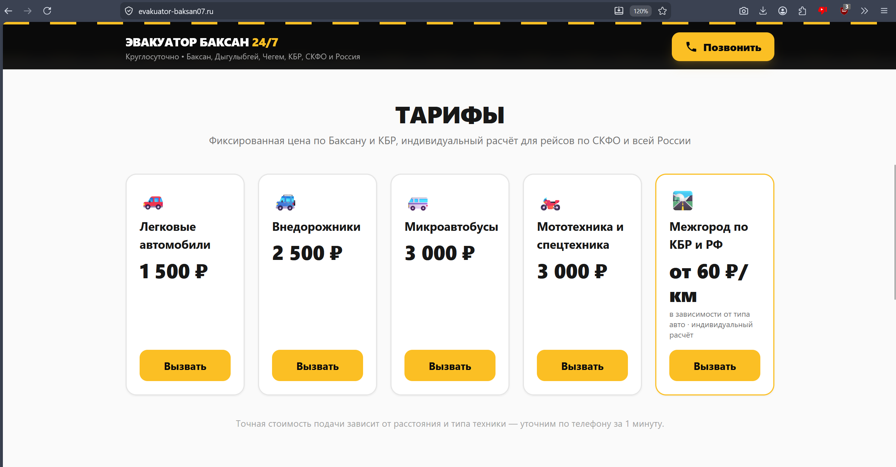

# 🚚 Служба эвакуации Баксан 24/7
 
Реальный коммерческий проект (фриланс-кейс) по разработке, оптимизации и развёртыванию под ключ адаптивного веб-сайта для службы эвакуации автомобилей, работающей на межрегиональном уровне: город Баксан (КБР) как база, выезды по всей Кабардино-Балкарии, СКФО и России.
 
🔗 **Живая ссылка на проект:** [evakuator-baksan07.ru](https://evakuator-baksan07.ru)
 
---
 
## 📱 Интерфейс системы
 

 
---
 
## 📋 О проекте
 
Одностраничный сайт-визитка, спроектированный по принципам Conversion Rate Optimization (CRO):
 
- Мгновенный звонок в один тап с любого экрана благодаря sticky-шапке
- Локальная привязка к географии — Баксан, Дыгулыбгей, Чегем, трасса Р-217 «Кавказ»
- Прозрачные фиксированные тарифы без необходимости уточнять цену по телефону
- Реальные фотографии техники для повышения доверия клиентов на трассе
---
 
## 🚀 Выполненные задачи и архитектурные решения
 
- **Масштабируемость и гео-адаптивность.** Изначально локальный интерфейс оперативно переработан под межрегиональный уровень (вызовы по КБР, СКФО и всей Российской Федерации). Внедрены динамические тарифные сетки для междугородних рейсов.
- **Mobile-First оптимизация.** Интерфейс спроектирован строго под мобильные устройства (95% целевого дорожного трафика). Из структуры исключены тяжёлые контентные блоки ради максимальной скорости загрузки в условиях слабого мобильного интернета на трассе.
- **Инфраструктура и Cost-Efficiency.** Из-за блокировок зарубежных CDN со стороны РКН инфраструктура перенесена на отечественный хостинг Amvera Cloud (серверы в Москве). Это обеспечивает 100% аптайм в РФ без VPN, посекундную тарификацию (~170 руб/мес) и автоматический выпуск SSL (HTTPS).
- **SEO & гео-интеграция.** Права собственности верифицированы в Google Search Console (через деплой HTML-файла верификации), настроена принудительная индексация роботами. Выполнена привязка бизнеса к Яндекс.Картам и Яндекс.Навигатору с указанием расширенной зоны оказания услуг. Добавлена структурированная микроразметка JSON-LD (Schema.org, тип `AutomotiveBusiness`) для локального SEO и расширенных сниппетов в поиске.
- **Маркетинговая интеграция.** Сгенерирован и привязан QR-код для физических носителей (визитки, брендирование спецтехники). В карточку организации на геосервисах и в фотогалерею на сайте интегрированы реальные фото техники для повышения конверсии. Настроен Telegram-бот мониторинга (`@Amvera_alert_bot`) для отслеживания баланса облачной инфраструктуры в реальном времени.
---
 
## 🛠 Технологический стек
 


 
| Технология | Назначение |
|---|---|
| **HTML5** | Семантическая разметка страницы |
| **Tailwind CSS** (через CDN) | Утилитарная стилизация, адаптивная вёрстка |
| **JSON-LD (Schema.org)** | Структурированные данные `AutomotiveBusiness` для локального SEO |
 
Проект не использует сборщики, npm-зависимости или JS-фреймворки — чистый статический HTML, готовый к деплою без этапа сборки.
 
---
 
## ☁️ Инфраструктура и DevOps
 
### Миграция с Netlify на Amvera Cloud
 
Проект был перенесён с зарубежного хостинга Netlify на российское облако **[Amvera Cloud](https://amvera.ru)** (веб-сервер на базе Nginx, физически размещённый в Москве).
 
**Причины миграции:**
 
- ✅ Гарантированная доступность сайта на территории РФ без зависимости от зарубежной инфраструктуры
- ✅ Устойчивость к возможным ограничениям иностранных CDN со стороны Роскомнадзора (РКН)
- ✅ Быстрая загрузка страницы для абонентов российских мобильных операторов (МТС, Билайн, МегаФон) — без необходимости VPN
- ✅ Посекундная тарификация облака (~170 руб/мес) — экономичнее фиксированных тарифов
- ✅ Автоматический выпуск и продление SSL-сертификата (HTTPS)
### Домен
 
Подключён коммерческий домен **`evakuator-baksan07.ru`** с автоматическим HTTPS через Amvera.
 
---
 
## 📈 SEO и маркетинговая интеграция
 
- **Google Search Console** — права собственности верифицированы через деплой HTML-файла подтверждения, настроена принудительная индексация страниц роботами
- **Яндекс Карты и Яндекс Навигатор** — карточка организации верифицирована, привязана расширенная зона оказания услуг
- **QR-код** — сгенерирован и используется на визитках и брендировании спецтехники для быстрого перехода на сайт
- **Telegram-бот мониторинга** (`@Amvera_alert_bot`) — уведомления о балансе облачной инфраструктуры в реальном времени, чтобы исключить незапланированное отключение сайта
---
 
## 🗺 Локальное SEO: ключевые регионы
 
Контент и мета-данные страницы (включая `<title>`, `description`, Open Graph и JSON-LD) намеренно оптимизированы под региональные поисковые запросы:
 
- г. Баксан
- с. Дыгулыбгей
- г. Чегем
- трасса Р-217 «Кавказ»
- вся КБР, СКФО и Россия (для межгородних рейсов)
Это увеличивает шансы попадания сайта в топ локальной выдачи Google и Яндекса при запросах вида «эвакуатор Баксан», «эвакуатор Чегем», «эвакуатор трасса Кавказ» и аналогичных.
 
---
 
## 📱 Особенности вёрстки
 
- **Mobile-first подход** — приоритетно рассчитан на клиентов, вызывающих эвакуатор со смартфона, стоя на дороге; тяжёлые блоки исключены ради скорости загрузки на слабом мобильном интернете
- **Sticky-шапка** с эффектом полупрозрачного стекла (glassmorphism), кнопка звонка всегда доступна при скролле
- **Нативный тактильный отклик** — все кнопки уменьшаются при нажатии (`active:scale-95`) для ощущения отзывчивости интерфейса
- Полностью **кликабельные номера телефона** (`tel:`-ссылки) во всех блоках страницы
- Адаптивная сетка тарифов и фотогалерея техники, корректно отображающиеся на любых экранах
---
 
## 📁 Структура репозитория
 
```
baksan-evakuator-landing/
├── index.html          # Основная страница лендинга
├── favicon.png         # Иконка сайта (вкладка браузера, PWA)
├── car1.jpg             # Фото эвакуатора — ракурс 1
├── car2.jpg             # Фото эвакуатора — ракурс 2
├── screenshot.png       # Скриншот главного экрана для README
└── README.md            # Документация проекта
```
 
---
 
## 🛠️ Как запустить проект локально
 
Чтобы развернуть веб-сайт службы эвакуации на своём компьютере, выполните следующие шаги:
 
1. **Клонируйте репозиторий:**
```bash
   git clone https://github.com/Asker323/baksan-evakuator-landing
```
 
2. **Перейдите в папку проекта:**
```bash
   cd baksan-evakuator-landing
```
 
3. **Запустите сайт:**
   Просто откройте файл `index.html` в любом современном браузере (двойным кликом мыши или перетаскиванием в окно браузера).
   Для локальной разработки с сервером можно также использовать:
```bash
   # Python 3
   python3 -m http.server 8000
 
   # Или через Node.js (npx)
   npx serve .
```
   После этого сайт будет доступен по адресу `http://localhost:8000`.
 
---
 
## 📞 Контакты
 
- **Телефон:** [8 (938) 700-09-48](tel:+79387000948)
- **Режим работы:** круглосуточно, без выходных
- **Зона обслуживания:** г. Баксан, с. Дыгулыбгей, г. Чегем, трасса Р-217 «Кавказ», вся КБР, СКФО и Россия
---
 
*Проект разработан в рамках формирования портфолио и практики развёртывания production-ready веб-ресурсов с нуля.*
